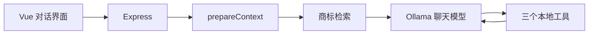
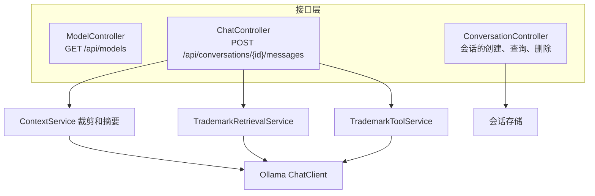

# 技术方案

现有程序是 Electron + Vue，本机 Express 接 Ollama。一条用户消息的顺序是：写入会话、`prepareContext` 裁剪历史、检索商标知识、模型决定是否调用工具、流式写回。

检索插在整理好的历史和当前问题之间，只把本次命中的段落放进这一次请求。工具在模型给出调用后再执行一轮。工具参数和返回不写入长期会话，界面只留下「已查询」和检索依据。

字数在主进程按「系统提示、资料、历史、工具结果」分开打印。单段资料超过 800 字时先截断再送入。

## 以后可以换的位置

会话现在写在本机 JSON。同一份字段可以迁到 MySQL：会话表存标题和摘要，消息表存角色、正文、依据和查询记录。

每次检索的查询和命中标题可以放进 Redis，用来挡住重复问题。资料更新后删掉对应缓存。

Ollama、Chroma 和这个 API 可以放进同一个 Docker Compose。界面仍然只访问本机 API。

向量现在在本机 Chroma。生产可以换成 pgvector 或 Elasticsearch，检索函数的输入输出不用改：还是按当前问题取最多 3 段，相似度不够就不附资料。

## 和 Spring Boot 的对照

下面这张图只说明模块怎么拆，不表示已经用 Java 重写。

| 现在的 Express | Spring Boot 模块 | 职责 |
| --- | --- | --- |
| `routes/models.js` | `ModelController` | 列出本机模型 |
| `routes/conversations.js` 的 GET、POST、DELETE | `ConversationController` | 会话创建、列表、读取、删除 |
| `POST /api/conversations/:id/messages` | `ChatController` | 收一条消息，用 SSE 流式返回 |
| `context.js` | `ContextService` | 超长历史裁剪和摘要 |
| `knowledge.js` | `TrademarkRetrievalService` | 切块、向量检索、截断资料 |
| `tools.js` | `TrademarkToolService` | 候选类别、材料清单、官费 |
| `conversations.js` | `ConversationStore` | 会话持久化。现在是 JSON，以后可以是 MySQL |
